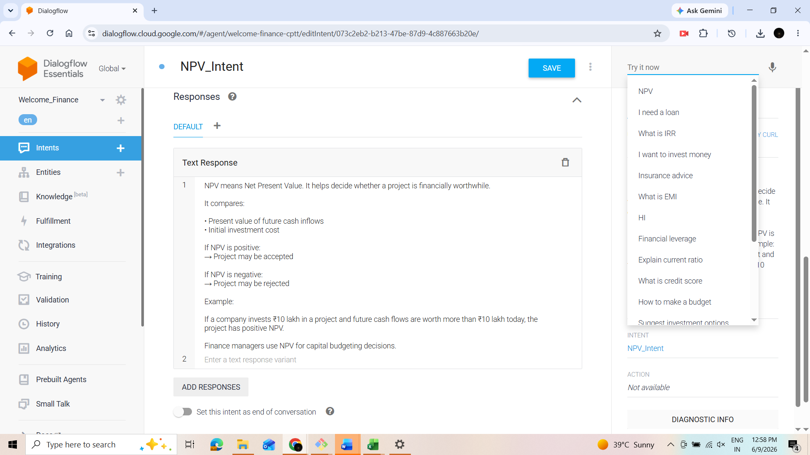
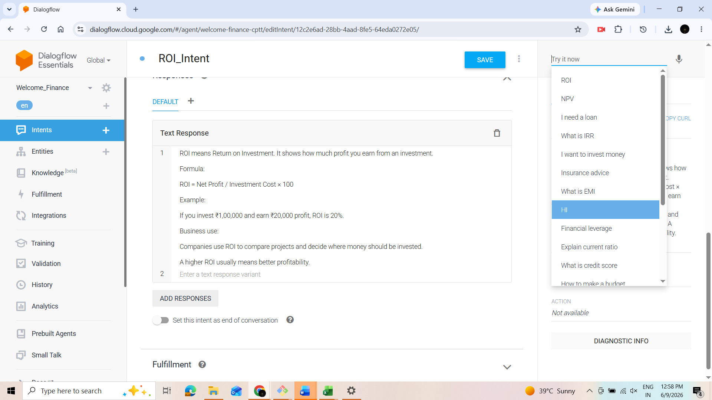

# 💰 AI-Powered Personal Finance Assistant

An intelligent finance assistant built to help users make informed financial decisions through AI-driven recommendations, financial calculators, ratio analysis, and fraud detection capabilities.

---

## 🚀 Features

### 🤖 AI Financial Chatbot
- Conversational finance assistant
- Answers finance-related queries
- Provides personalized guidance

### 📊 Financial Calculators
- EMI Calculator
- NPV (Net Present Value) Calculator
- IRR (Internal Rate of Return) Calculator
- ROI (Return on Investment) Calculator
- Breakeven Analysis Calculator

### 📈 Financial Ratio Analysis
- Current Ratio Calculator
- Debt-to-Equity Ratio Calculator
- Credit Score Advisor

### 💵 Financial Advisory Modules
- Investment Advisor
- Loan Advisor
- Insurance Advisor
- Budgeting Advisor

### 🔒 Fraud Detection System
- Detects potentially fraudulent financial transactions
- Risk-based classification
- Fraud monitoring dashboard

### 💬 Smart Intent Recognition
The chatbot can automatically identify user intents such as:

- Budgeting Advice
- Investment Guidance
- Loan Advisory
- Insurance Advisory
- Credit Score Analysis
- EMI Calculation
- NPV Calculation
- IRR Calculation
- ROI Calculation
- Break-even Analysis

---

## 🏗️ Project Architecture

```text
User
  │
  ▼
Finance Chatbot
  │
  ├── Budgeting Advisor
  ├── Investment Advisor
  ├── Loan Advisor
  ├── Insurance Advisor
  ├── Credit Score Advisor
  │
  ├── EMI Calculator
  ├── NPV Calculator
  ├── IRR Calculator
  ├── ROI Calculator
  ├── Breakeven Calculator
  │
  └── Fraud Detection Engine
```

---

## 📂 Project Screenshots

### Welcome Screen


### Chatbot Interface


### Budgeting Advisor


### Investment Advisor


### Loan Advisor


### Insurance Advisor


### Credit Score Advisor


### EMI Calculator


### NPV Calculator


### IRR Calculator


### ROI Calculator


### Break-even Analysis


### Current Ratio Calculator


### Debt Equity Ratio


### Fraud Detection Dashboard


---

## 🛠️ Technologies Used

- Generative AI
- NLP (Natural Language Processing)
- Financial Analytics
- Machine Learning
- Fraud Detection Models
- Python
- Financial Modeling Techniques

---

## 📌 Use Cases

- Personal Financial Planning
- Investment Decision Support
- Loan Assessment
- Insurance Recommendation
- Credit Score Guidance
- Financial Ratio Analysis
- Fraud Monitoring
- Business Feasibility Analysis

---

## 🎯 Future Enhancements

- Real-time stock market integration
- Portfolio optimization
- Credit risk prediction
- Voice-enabled finance assistant
- Personalized financial planning
- Banking API integration

---

## 👨‍💻 Author

**Akshay Kumar**

MBA Finance | Financial Analytics | AI & Finance Enthusiast

---
⭐ If you found this project useful, consider giving it a star.# Dialogflow-AI-Agents# Dialogflow-AI-Agent
